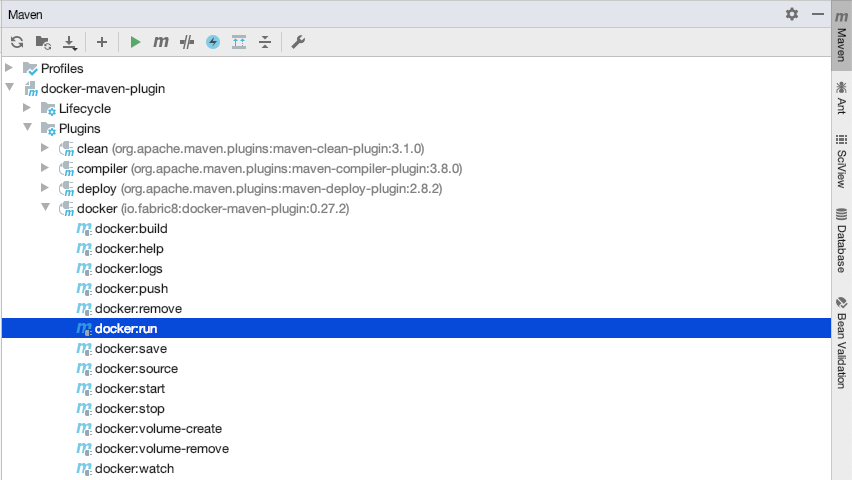

In my latest project I have implemented all communication with my Elasticsearch cluster using the high level REST client. My next step was to setup and teardown an Elasticsearch instance automatically in order to facilitate proper integration testing. This article describes three different ways of doing so and discusses some of the pros and cons. Please refer to [this repository][1] for implementations of all three methods.

### [docker-maven-plugin][2]

This generic Docker plugin allows you to bind the starting and stopping of Docker containers to [Maven lifecycles][3]. You specify two blocks within the plugin; `configuration` and `executions`. In the `configuration` block, you choose the image that you want to run (Elasticsearch 6.5.3 in this case), the ports that you want to expose, a health check and any environment variables. See the snippet below for a complete example:

    <plugin>
        <groupId>io.fabric8</groupId>
        <artifactId>docker-maven-plugin</artifactId>
        <version>0.32</version>
        <configuration>
            <imagePullPolicy>always</imagePullPolicy>
            <images>
                <image>
                    <alias>docker-elasticsearch-integration-test</alias>
                    <name>elasticsearch/elasticsearch:6.5.3</name>
                    <run>
                        <namingStrategy>alias</namingStrategy>
                        <ports>
                            <port>9299:9200</port>
                            <port>9399:9300</port>
                        </ports>
                        <env>
                            <cluster.name>integration-test-cluster</cluster.name>
                        </env>
                        <wait>
                            <http>
                                <url>http://localhost:9299</url>
                                <method>GET</method>
                                <status>200</status>
                            </http>
                            <time>60000</time>
                        </wait>
                    </run>
                </image>
            </images>
        </configuration>
        <executions>
            <execution>
                <id>docker:start</id>
                <phase>pre-integration-test</phase>
                <goals>
                    <goal>start</goal>
                </goals>
            </execution>
            <execution>
                <id>docker:stop</id>
                <phase>post-integration-test</phase>
                <goals>
                    <goal>stop</goal>
                </goals>
            </execution>
        </executions>
    </plugin>
    

You can see that I've bound the plugin to the pre- and post-integration-test lifecycle phases. By doing so, the Elasticsearch container will be started just before any integration tests are ran and will be stopped after the integration tests have finished. I've used the [maven-failsafe-plugin][4] in order to trigger the execution of tests ending with `*IT.java` in the integration-test lifecycle phase.

Since this is a generic Docker plugin, there is no special functionality to easily install Elasticsearch plugins that may be needed during your integration tests. You could however [create your own image with the required plugins][5] and pull that image during your integration tests.

The integration with IntelliJ is also not optimal. When running an `*IT.java` class, IntelliJ will not trigger the correct lifecycle phases and will attempt to run your integration test without creating the required Docker container. Before running an integration test from IntelliJ, you need to manually start the container from the "Maven projects" view by running the `docker:run` commando:

After running, you will also need to run the `docker:stop` commando to kill the container that is still running. If you forget to kill the running container and want to run a `mvn clean install` later on it will fail, since the build will attempt to create a container on the same port - as far as I know, the plugin does not allow for random ports to be chosen.

**Pros:**

*   Little setup, only requires configuration of one Maven plugin

**Cons:**

*   No out of the box functionality to start the Elasticsearch instance on a random port 
*   No out of the box functionality to install extra Elasticsearch plugins 
*   Extra dependency in your build pipeline (Docker) 
*   IntelliJ does not trigger the correct lifecycle phases

### [elasticsearch-maven-plugin][7]

This second plugin does not require Docker and only needs some Maven configuration to get started. See the snippet below for a complete example:

    <plugin>
        <groupId>com.github.alexcojocaru</groupId>
        <artifactId>elasticsearch-maven-plugin</artifactId>
        <version>6.16</version>
        <configuration>
            <version>6.5.3</version>
            <clusterName>integration-test-cluster</clusterName>
            <transportPort>9399</transportPort>
            <httpPort>9299</httpPort>
        </configuration>
        <executions>
            <execution>
                <id>start-elasticsearch</id>
                <phase>pre-integration-test</phase>
                <goals>
                    <goal>runforked</goal>
                </goals>
            </execution>
            <execution>
                <id>stop-elasticsearch</id>
                <phase>post-integration-test</phase>
                <goals>
                    <goal>stop</goal>
                </goals>
            </execution>
        </executions>
    </plugin>
    

Again, I've bound the plugin to the pre- and post-integration-test lifecycle phases in combination with the maven-failsafe-plugin.

This plugin provides a way of starting the Elasticsearch instance from IntelliJ in much the same way as the docker-maven-plugin. You can run the `elasticsearch:runforked` commando from the "Maven projects" view. However in my case, this started the container and then immediately exited. There is also no out of the box possibility of setting a random port for your instance. However, [there are solutions to this][8] at the expense of having a somewhat more complex Maven configuration.

Overall, this is a plugin that seems to provide almost everything we need with a lot of configuration options. You can automatically [install Elasticsearch plugins][9] or even [bootstrap your instance with data][10].

In practice I did have some problems using the plugin in my build pipeline. Upon downloading the Elasticsearch ZIP the build would sometimes fail, or in other cases when attempting to download a plugin. Your mileage may vary, but this was reason for me to keep looking for another solution. Which brings me to plugin number three.

**Pros:**

*   Little setup, only requires configuration of one Maven plugin 
*   No extra external dependencies 
*   High amount of configuration possible

**Cons:**

*   No out of the box functionality to start the Elasticsearch instance on a random port 
*   Poor integration with IntelliJ 
*   Seems unstable

### [testcontainers-elasticsearch][11]

This third plugin is different from the other two. It uses a [Java testcontainer][12] that you can configure through Java code. This gives you a lot of flexibility and requires no Maven configuration. Since there is no Maven configuration, it does require some work to make sure the Elasticsearch container is started and stopped at the correct moments.

In order to realize this, I have extended the standard `SpringJUnit4ClassRunner` class with my own `ElasticsearchSpringRunner`. In this runner, I have added a new JUnit RunListener named `JUnitExecutionListener`. This listener defines two methods `testRunStarted` and `testRunFinished` that enable me to start and stop the Elasticsearch container at the same points in time that the pre- and post-integration-test Maven lifecycle phases would. See the snippet below for the implementation of the listener:

    package nl.luminis.articles.elasticsearch.integration.testcontainers;
    
    import org.junit.runner.Description;
    import org.junit.runner.Result;
    import org.junit.runner.notification.RunListener;
    import org.junit.runner.notification.RunNotifier;
    
    import io.restassured.RestAssured;
    import lombok.extern.slf4j.Slf4j;
    import org.testcontainers.elasticsearch.ElasticsearchContainer;
    
    @Slf4j

    public class JUnitExecutionListener extends RunListener {
    
        private static final String ELASTICSEARCH_IMAGE = "docker.elastic.co/elasticsearch/elasticsearch";
        private static final String ELASTICSEARCH_VERSION = "6.5.3";
        private static final String ELASTICSEARCH_HOST_PROPERTY = "spring.elasticsearch.rest.uris";
        private static final int ELASTICSEARCH_PORT = 9200;
    
        private ElasticsearchContainer container;
        private RunNotifier notifier;
    
        public JUnitExecutionListener(RunNotifier notifier) {
            this.notifier = notifier;
        }
    
        @Override
        public void testRunStarted(Description description) {
            try {
                if (System.getProperty(ELASTICSEARCH_HOST_PROPERTY) == null) {
                    log.debug("Create Elasticsearch container");
                    int mappedPort = createContainer();
                    System.setProperty(ELASTICSEARCH_HOST_PROPERTY, "localhost:" + mappedPort);
                    String host = System.getProperty(ELASTICSEARCH_HOST_PROPERTY);
                    RestAssured.basePath = "";
                    RestAssured.baseURI = "http://" + host.split(":")[0];
                    RestAssured.port = Integer.parseInt(host.split(":")[1]);
                    log.debug("Created Elasticsearch container at {}", host);
                }
            } catch (Exception e) {
                notifier.pleaseStop();
                throw e;
            }
        }
    
        @Override
        public void testRunFinished(Result result) {
            if (container != null) {
                String host = System.getProperty(ELASTICSEARCH_HOST_PROPERTY);
                log.debug("Removing Elasticsearch container at {}", host);
                container.stop();
            }
        }
    
        private int createContainer() {
            container = new ElasticsearchContainer();
            container.withBaseUrl(ELASTICSEARCH_IMAGE);
            container.withVersion(ELASTICSEARCH_VERSION);
            container.withEnv("cluster.name", "integration-test-cluster");
            container.start();
            return container.getMappedPort(ELASTICSEARCH_PORT);
        }
    }

It will create an Elasticsearch Docker container on a random port for use by the integration tests. The best thing about having this runner is that it works perfectly fine in IntelliJ. Simply right-click and run your `*IT.java` classes annotated with `@RunWith(ElasticsearchSpringRunner.class)` and IntelliJ will use the listener to setup the Elasticsearch container. This allows you to automate your build pipeline while still keeping developers happy.

**Pros:**

*   Neat integration with both Java and therefore your IDE 
*   Sufficient configuration options out of the box

**Cons:**

*   More complex initial setup 
*   Extra dependency in your build pipeline (Docker)

In summary, all three of the above plugins are able to realize the goal of starting an Elasticsearch instance for your integration testing. For me personally, I will be using the testcontainers-elasticsearch plugin going forward. The extra Docker dependency is not a problem since I use Docker in most of my build pipelines anyway. Furthermore, the integration with Java allows me to configure things in such a way that it works perfectly fine from both the command line and the IDE.

Feel free to [checkout the code behind this article][1], play around with the integration tests that I've setup there and decide for yourself which plugin suits your needs best.

 [1]: https://github.com/markkrijgsman/elasticsearch-integration-testing
 [2]: https://github.com/fabric8io/docker-maven-plugin
 [3]: https://maven.apache.org/guides/introduction/introduction-to-the-lifecycle.html
 [4]: https://maven.apache.org/surefire/maven-failsafe-plugin/integration-test-mojo.html#includes
 [5]: https://hub.docker.com/r/markkrijgsman/elasticsearch-analysis-plugins/~/dockerfile/
 [6]: https://amsterdam.luminis.eu/wp-content/uploads/2018/08/intellij-maven-projects-view.png
 [7]: https://github.com/alexcojocaru/elasticsearch-maven-plugin
 [8]: https://github.com/alexcojocaru/elasticsearch-maven-plugin/issues/11#issuecomment-169175954
 [9]: https://github.com/alexcojocaru/elasticsearch-maven-plugin#plugins
 [10]: https://github.com/alexcojocaru/elasticsearch-maven-plugin#initScript
 [11]: https://github.com/dadoonet/testcontainers-java-module-elasticsearch
 [12]: https://www.testcontainers.org/